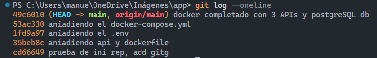
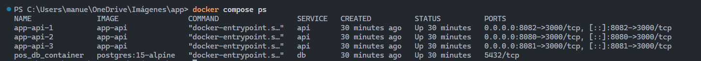
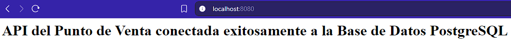
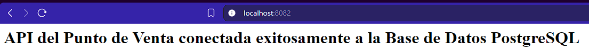

Este repositorio contiene la infraestructura para levantar 3 réplicas de la API y una base de datos PostgreSQL, utilizando Docker Compose.

## Comandos de Ejecución
Iniciar la infraestructura en segundo plano: `docker compose up -d`
Verificar que las réplicas y la BD estén funcionando: `docker compose ps`
Detener los servicios: `docker compose down`

## Análisis Técnico de Docker

### Tipos de Volúmenes
1 Named Volumes (Volúmenes Nombrados): Gestionados completamente por Docker. Es la opción que implementé para la base de datos, ya que es la forma más segura de garantizar que la información transaccional persista de manera independiente a si el contenedor se reinicia o se elimina.
2 Bind Mounts: Mapean una ruta específica de la máquina local al contenedor. Son excelentes para el entorno de desarrollo, pero no son la mejor práctica para bases de datos en producción.
3 tmpfs Mounts: Almacenan datos de forma temporal directamente en la memoria RAM del host. Son útiles para gestionar información sensible que no debe persistir en disco.

### Tipos de Redes
1 Bridge: Red privada por defecto. Elegí esta arquitectura porque permite que las réplicas de la API se comuniquen directamente con PostgreSQL en un entorno aislado, sin exponer la base de datos a conexiones externas.
2 Host: Elimina el aislamiento, compartiendo la misma interfaz de red de la máquina local.
3 Overlay: Permite conectar contenedores distribuidos en distintas máquinas (ideal para clústeres como Docker Swarm).
4 Macvlan: Asigna una dirección MAC única al contenedor, integrándolo como si fuera un dispositivo físico más en la red.
5 None: Deshabilita cualquier interfaz de red, aislando el contenedor por completo.

## Evidencias y Funcionamiento del Sistema

A continuación se muestran las capturas de pantalla que demuestran el despliegue, el control de versiones y el funcionamiento en los diferentes puertos configurados:

### 1. Control de Versiones (Commits)
Aquí se evidencia el registro de los cambios realizados en el desarrollo del proyecto:

### 2. Despliegue con Docker
Visualización de los contenedores activos y corriendo correctamente:

### 3. Pruebas en los Puertos del Sistema
Validación de los servicios ejecutándose en sus respectivos puertos:

* **Puerto 8080:**
  

* **Puerto 8081:**
  

* **Puerto 8082:**
  